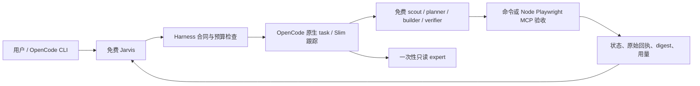

# 实现结构

只有原生 task 负责子任务执行。plugin.mjs 组合固定版本 Slim，在 task 前后校验并记录，不另起调度器。Slim 的自动付费 fallback、公共 MCP、自动更新、额外命令和外部编排工具关闭。

- `src/engine.mjs`：状态机、不可变合同、证据摘要与源文件 hash、预算预留、精确写入范围、审查与 attempt 绑定、MCP 固定步骤回执。
- `src/plugin.mjs`：OpenCode 工具/事件/hook 适配，角色/模型权限，原生子会话绑定与恢复，Slim 组合。
- `src/prompts.mjs`：主代理的动态决策指引和角色提示；提示不能绕过程序限制。
- `src/init.mjs`、`bin/cli.mjs`：初始化、JSONC 保留、备份、doctor、状态、原会话恢复、费用核对与报告。
- `eval/`：两项可复现任务、受控模型网关、官方 Playwright MCP 配置、协议夹具。模型网关与 MCP 夹具都清楚标注为测试实现。

生命周期：queued → prepared → running → verifying → accepted；另有 failed / unknown / cancelled。verifying 是子任务输出就绪，不是完成业务验收。verifier 可以完成一个 fail verdict；候选任务仍不能 accepted。

状态锁覆盖本工作目录。相同文件的并发 writer 被拒绝；相同浏览器 MCP 的验收串行租用。任务输入带来源片段和 hash，结果保留在本地。专家不继承全部主会话历史；给出的证据 packet 有大小上限。

固定检查是质量下限；业务正确性还需要独立语义审查和人工最终验收。自由设计、跨仓知识完整性、真实模型能力仍需实际校准。
